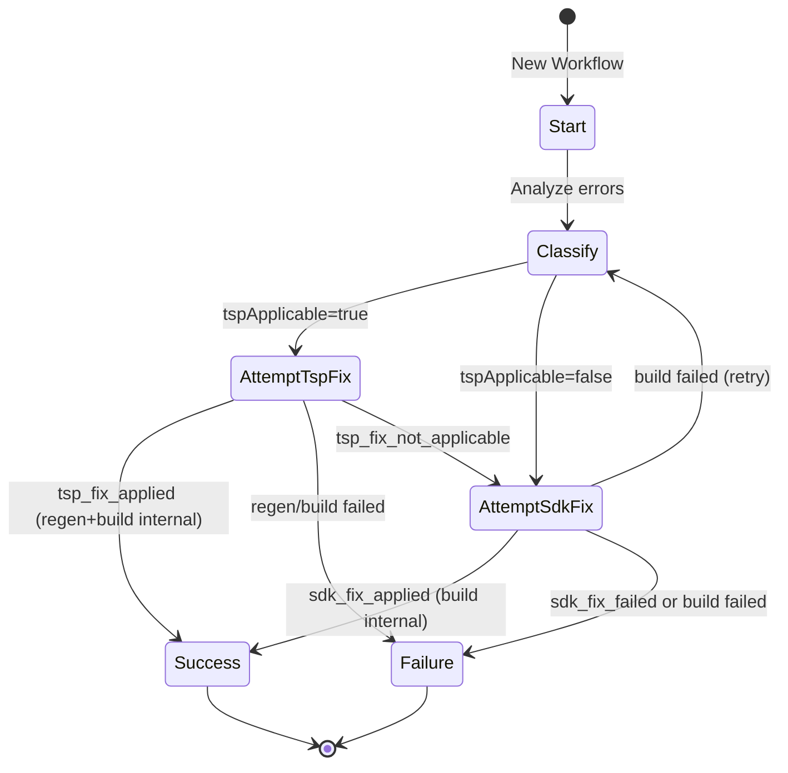
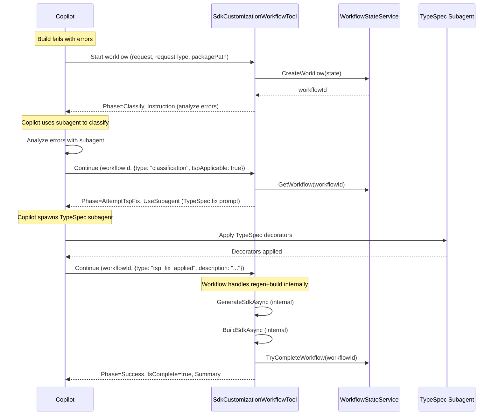
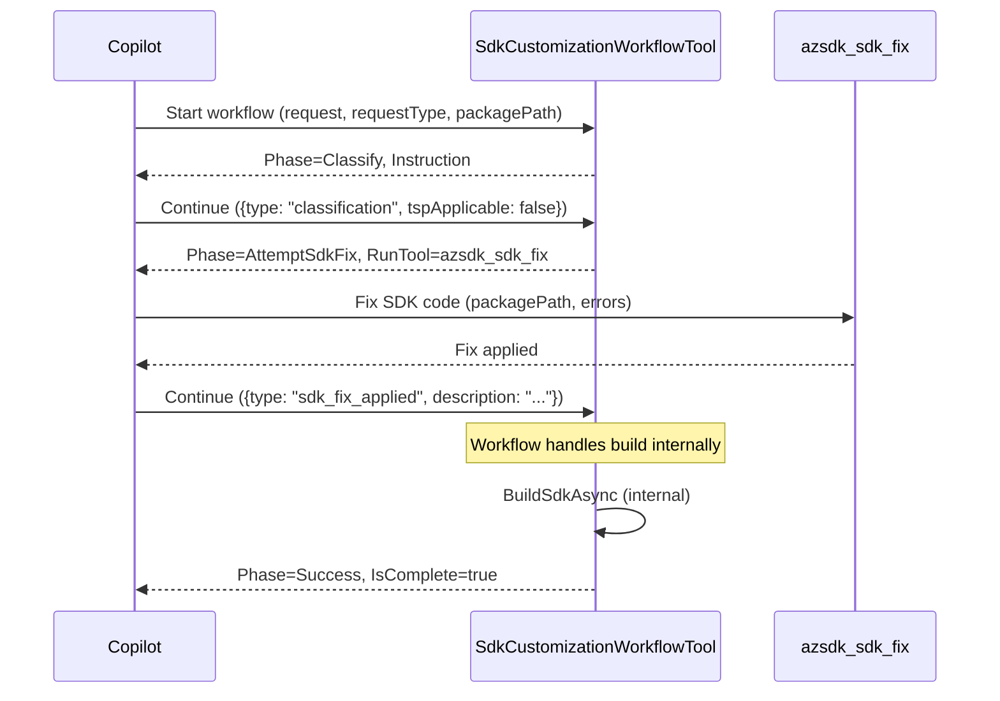
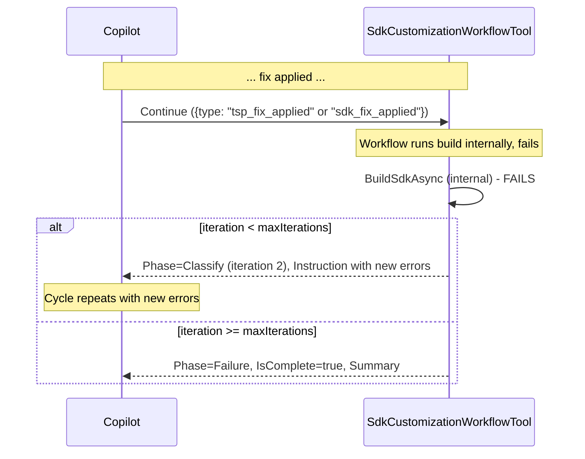
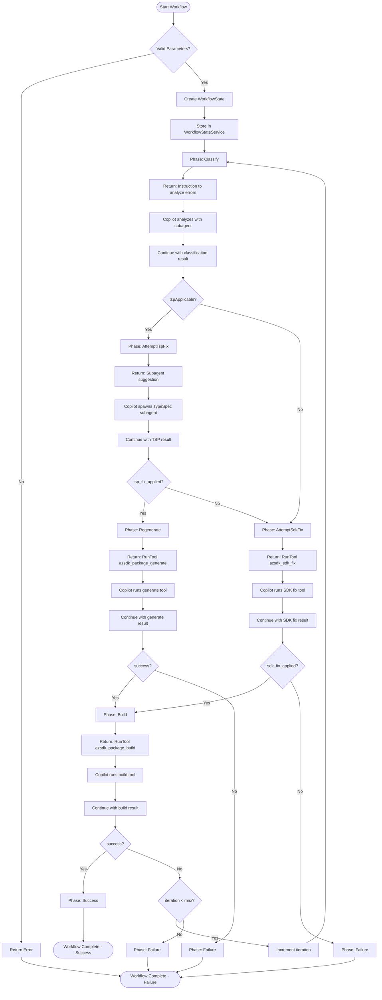

# SDK Customization Workflow Tool Documentation

This document describes the `azsdk_sdk_customization_workflow` MCP tool, which coordinates automated fixing of SDK build errors through TypeSpec decorators and SDK code customizations.

## Overview

The SDK Customization Workflow Tool acts as a **state machine coordinator** that:
- Analyzes build errors to determine the best fix approach
- Orchestrates TypeSpec decorator fixes or SDK code patches
- Manages iterative fix attempts with build verification
- Maintains workflow state across multiple tool invocations
- **Enforces continuation** - uses explicit continuation instructions to ensure the agent follows through with each workflow step

## Architecture

```
┌─────────────────────────────────────────────────────────────────┐
│                    Copilot Agent (Caller)                       │
└─────────────────────────────────────────────────────────────────┘
                              │
                              ▼
┌─────────────────────────────────────────────────────────────────┐
│              SdkCustomizationWorkflowTool                       │
│  ┌──────────────────────────────────────────────────────────┐   │
│  │              State Machine Coordinator                    │   │
│  │  • Tracks workflow phases                                 │   │
│  │  • Returns instructions for Copilot                       │   │
│  │  • Does NOT execute fixes directly                        │   │
│  └──────────────────────────────────────────────────────────┘   │
└─────────────────────────────────────────────────────────────────┘
                              │
              ┌───────────────┼───────────────┐
              ▼               ▼               ▼
┌─────────────────┐  ┌────────────────┐  ┌────────────────┐
│  TypeSpec       │  │  azsdk_sdk_fix │  │ azsdk_package_ │
│  Subagent       │  │                │  │ generate/build │
│  (decorators)   │  │  (code patches)│  │                │
└─────────────────┘  └────────────────┘  └────────────────┘
```

## Workflow Phases

The workflow tool now handles regeneration and building **internally**, reducing the number of agent round-trips. The agent only needs to interact for classification and fix application steps.



**Note:** After a fix is applied, the workflow tool automatically:
1. Regenerates the SDK (for TypeSpec fixes only)
2. Builds to verify the fix
3. Returns success, failure, or loops back to classify if build fails

This means the agent only needs to:
1. Classify errors → call workflow with result
2. Apply fix (TypeSpec or SDK) → call workflow with result
3. Workflow handles the rest internally

## Sequence Diagrams

### Successful TypeSpec Fix Flow



### SDK Code Fix Flow (TypeSpec Not Applicable)



### Iterative Fix Flow (Build Fails, Retry)



## API Reference

### Starting a New Workflow

| Parameter | Required | Description |
|-----------|----------|-------------|
| `request` | Yes | Build errors or user request text |
| `requestType` | Yes | `"build_error"` or `"user_request"` |
| `packagePath` | Yes | Absolute path to SDK package directory |
| `typeSpecPath` | No | Absolute path to TypeSpec project (can be discovered) |
| `maxIterations` | No | Maximum fix iterations (default: 3) |

**Example:**
```json
{
  "request": "error CS0246: The type or name 'MyModel' could not be found",
  "requestType": "build_error",
  "packagePath": "/path/to/azure-sdk-for-net/sdk/storage/Azure.Storage.Blobs",
  "maxIterations": 3
}
```

### Continuing a Workflow

| Parameter | Required | Description |
|-----------|----------|-------------|
| `workflowId` | Yes | Workflow ID from previous call |
| `result` | Yes | JSON result from completed step |

### Result Types

#### Classification Result
```json
{
  "type": "classification",
  "tspApplicable": true
}
```

#### TypeSpec Fix Result
```json
// Success
{
  "type": "tsp_fix_applied",
  "description": "Added @clientName decorator to rename Property1 to Name"
}

// Failure
{
  "type": "tsp_fix_not_applicable",
  "reason": "Error requires implementation changes, not naming"
}
```

#### SDK Fix Result
```json
// Success
{
  "type": "sdk_fix_applied",
  "description": "Updated method signature to match generated code"
}

// Failure
{
  "type": "sdk_fix_failed",
  "reason": "Cannot automatically fix this error type"
}
```

> **Note:** Generate and build operations are now handled internally by the workflow tool. The agent no longer needs to provide `generate_complete` or `build_complete` results.

## Response Structure

Each workflow response includes:

| Field | Description |
|-------|-------------|
| `phase` | Current workflow phase |
| `message` | Human-readable status message |
| `instruction` | Text instructions for Copilot (Classify phase) |
| `expected_result` | Schema for the expected result JSON |
| `use_subagent` | Suggestion to spawn a subagent (TypeSpec fixes) |
| `run_tool` | Tool to execute with arguments |
| `workflow_id` | ID to use for continuation |
| `is_complete` | Whether workflow has finished |
| `status` | Final status (`"success"` or `"failure"`) |
| `summary` | Markdown summary of workflow (on completion) |
| `continuation_required` | **Boolean indicating the agent MUST call back** |
| `continuation_instruction` | **Explicit instruction for how to continue** |
| `progress` | **Step tracking (current/total, completed/remaining steps)** |

### Continuation Enforcement

The tool uses three mechanisms to ensure agents stay on-script:

1. **`continuation_required: true`** - Explicit boolean flag that signals the workflow is not complete
2. **`continuation_instruction`** - Imperative text telling the agent exactly what to do next, e.g.:
   ```
   ⚠️ CRITICAL: After running the build tool, you MUST immediately call the 
   azsdk_sdk_customization_workflow tool again with:
     - workflowId: "workflow-abc123"
     - result: <JSON result of the completed action>
   
   DO NOT proceed to other tasks. DO NOT report completion to the user. 
   The workflow is NOT complete until you receive a response with is_complete=true.
   ```
3. **`progress`** - Visual indicator showing step X of Y to make incomplete state obvious:
   ```json
   {
     "current_step": 2,
     "total_steps": 4,
     "completed_steps": ["Classify"],
     "remaining_steps": ["Regenerate", "Build"]
   }
   ```

### Example Response (Non-Terminal)

```json
{
  "phase": "AttemptTspFix",
  "message": "Attempting to fix with TypeSpec decorators...",
  "use_subagent": {
    "type": "typespec",
    "prompt": "..."
  },
  "expected_result": { ... },
  "workflow_id": "workflow-abc123",
  "is_complete": false,
  "continuation_required": true,
  "continuation_instruction": "⚠️ CRITICAL: After applying TypeSpec decorators, you MUST immediately call the azsdk_sdk_customization_workflow tool again...",
  "progress": {
    "current_step": 2,
    "total_steps": 4,
    "completed_steps": ["Classify"],
    "remaining_steps": ["Regenerate", "Build"]
  }
}
```

### Example Response (Terminal - Success)

```json
{
  "phase": "Success",
  "message": "✅ Build succeeded! Workflow complete.",
  "is_complete": true,
  "status": "success",
  "summary": "## SDK Customization Workflow Summary\n...",
  "workflow_id": "workflow-abc123",
  "continuation_required": false,
  "progress": {
    "current_step": 4,
    "total_steps": 4,
    "completed_steps": ["Classify", "Fix", "Build"],
    "remaining_steps": []
  }
}
```

## Workflow Phases Detail

### 1. Classify Phase

**Purpose:** Analyze build errors to determine if TypeSpec decorators can help.

**What Copilot Does:**
1. Reads `eng/common/knowledge/customizing-client-tsp.md` via subagent
2. Analyzes errors against available TypeSpec customizations
3. Returns classification result

**TypeSpec Can Help With:**
- Naming issues (`@clientName`)
- Visibility/access issues (`@access`)
- Model usage issues (`@usage`)
- Client structure issues (`@client`, `@operationGroup`)

**TypeSpec Cannot Help With:**
- Implementation logic errors
- Missing dependencies
- Syntax errors in customization code

### 2. AttemptTspFix Phase

**Purpose:** Apply TypeSpec decorators to fix the errors.

**What Copilot Does:**
1. Spawns TypeSpec-focused subagent
2. Subagent reads customization documentation
3. Applies appropriate decorators to `client.tsp`
4. Reports what was changed

### 3. Regenerate Phase

**Purpose:** Regenerate SDK code after TypeSpec changes.

**Tool:** `azsdk_package_generate`

### 4. AttemptSdkFix Phase

**Purpose:** Apply patches to SDK customization code.

**Tool:** `azsdk_sdk_fix`

This tool uses language-specific services to automatically patch customization files.

### 5. Build Phase

**Purpose:** Verify the fix by building the SDK.

**Tool:** `azsdk_package_build`

**On Success:** Workflow completes successfully
**On Failure:** 
- If iterations remain: Returns to Classify with new errors
- If max iterations reached: Workflow fails

## State Management

Workflow state is managed by `WorkflowStateService`:

```
┌─────────────────────────────────────────┐
│         WorkflowStateService            │
│                                         │
│  activeWorkflows: ConcurrentDictionary  │
│  completedWorkflowIds: HashSet          │
│                                         │
│  • CreateWorkflow() → workflowId        │
│  • GetWorkflow(id) → state              │
│  • UpdateWorkflow(id, state)            │
│  • TryCompleteWorkflow(id) → bool       │
└─────────────────────────────────────────┘
```

**Notes:**
- State is stored in-memory (lost on server restart)
- Completed workflows cannot be reused
- Each workflow gets a unique GUID-based ID

## Data Models

### WorkflowState

```csharp
class WorkflowState {
    string WorkflowId
    WorkflowPhase Phase
    string EntryType         // "build_error" | "user_request"
    string OriginalRequest
    string CurrentErrors     // Updated on build failure
    string? LastFixType      // "tsp" | "sdk"
    int Iteration
    int MaxIterations
    string PackagePath
    string TypeSpecPath
    List<WorkflowHistoryEntry> History
}
```

### WorkflowHistoryEntry

```csharp
class WorkflowHistoryEntry {
    int Iteration
    WorkflowPhase Phase
    string Action
    string Result           // "success" | "failure" | "skipped"
    string? Details
}
```

## Example Usage

### CLI Usage

```bash
# Start new workflow
azsdk package workflow \
  --request "error CS0246: The type 'MyModel' could not be found" \
  --request-type build_error \
  --package-path /path/to/sdk/package

# Continue workflow
azsdk package workflow \
  --workflow-id workflow-abc123 \
  --result '{"type": "classification", "tspApplicable": true}'
```

### MCP Tool Usage

```json
// Start
{
  "name": "azsdk_sdk_customization_workflow",
  "arguments": {
    "request": "error CS0246: The type 'MyModel' could not be found",
    "requestType": "build_error",
    "packagePath": "/path/to/sdk/package"
  }
}

// Continue
{
  "name": "azsdk_sdk_customization_workflow",
  "arguments": {
    "workflowId": "workflow-abc123",
    "result": "{\"type\": \"classification\", \"tspApplicable\": true}"
  }
}
```

## Complete Workflow Flowchart



## Related Tools

| Tool | Purpose |
|------|---------|
| `azsdk_sdk_customization_workflow` | Workflow coordinator (this tool) |
| `azsdk_sdk_fix` | Applies patches to SDK customization code |
| `azsdk_package_generate` | Regenerates SDK from TypeSpec |
| `azsdk_package_build` | Builds/compiles the SDK package |

## Related Documentation

- [`eng/common/knowledge/customizing-client-tsp.md`](eng/common/knowledge/customizing-client-tsp.md) - TypeSpec customization reference
