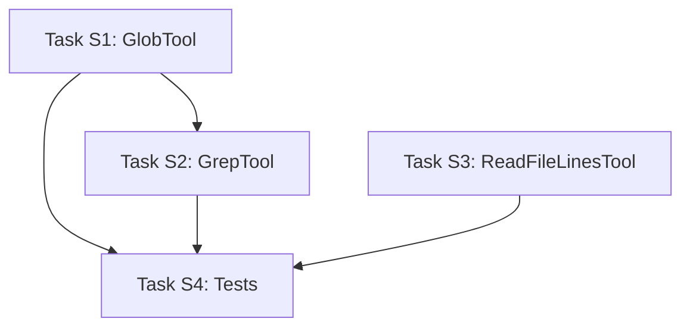

# Search Tools Implementation Plan

> **Goal**: Add efficient search tools to reduce token usage in the TypeSpec Customization Microagent
>
> **Project Location**: `tools/azsdk-cli/Azure.Sdk.Tools.Cli/Microagents/Tools/`
>
> **Constraint**: Pure C#/.NET implementation - no external binaries (ripgrep, etc.)

## Problem

The current microagent only has `ReadFileTool` which reads entire files. This leads to high token usage when the agent needs to:
- Find specific patterns/symbols across files
- Locate relevant code sections before reading
- Search for usages of decorators, types, or functions

## Solution

Add three new search tools that enable a **search-first, read-later** pattern:

1. **GrepTool** - Search file contents for patterns
2. **GlobTool** - Find files by name patterns  
3. **ReadFileLinesTool** - Read specific line ranges from files

## Architecture

```
┌─────────────────────────────────────────────────────────────────┐
│                    Token-Efficient Workflow                      │
├─────────────────────────────────────────────────────────────────┤
│  1. GlobTool("**/*.tsp")           → Get file paths only        │
│  2. GrepTool("@clientName", ...)   → Get matching files + lines │
│  3. ReadFileLinesTool(file, 45-60) → Read only relevant section │
└─────────────────────────────────────────────────────────────────┘
```

---

## Implementation Tasks

### Task S1: Create GlobTool

**File:** `Azure.Sdk.Tools.Cli/Microagents/Tools/GlobTool.cs`

**Purpose:** Find files by name patterns (e.g., `**/*.tsp`, `src/**/*.cs`)

**Input Schema:**
```csharp
public record GlobInput(
    [property: Description("Glob pattern to match files (e.g., '**/*.tsp', 'src/**/*.cs')")]
    string Pattern
);
```

**Output Schema:**
```csharp
public record GlobOutput(
    [property: Description("List of matching file paths relative to base directory")]
    string[] Files
);
```

**Implementation Notes:**
- Use `Microsoft.Extensions.FileSystemGlobbing` NuGet package (already in .NET ecosystem)
- Constructor takes `baseDir` parameter (like existing tools)
- Return paths relative to baseDir
- Support standard glob patterns: `*`, `**`, `?`, `{a,b}`

**Acceptance Criteria:**
- [ ] Tool finds files matching glob patterns
- [ ] Paths are relative to baseDir
- [ ] Handles nested directories with `**`
- [ ] Returns empty array if no matches
- [ ] Unit tests pass

---

### Task S2: Create GrepTool

**File:** `Azure.Sdk.Tools.Cli/Microagents/Tools/GrepTool.cs`

**Purpose:** Search file contents for regex patterns

**Input Schema:**
```csharp
public record GrepInput(
    [property: Description("Regex pattern to search for")]
    string Pattern,
    
    [property: Description("Optional glob pattern to filter files (e.g., '**/*.tsp'). Defaults to all files.")]
    string? FilePattern = null,
    
    [property: Description("If true, performs case-insensitive matching. Defaults to false.")]
    bool IgnoreCase = false,
    
    [property: Description("Number of context lines to include before each match. Defaults to 0.")]
    int ContextBefore = 0,
    
    [property: Description("Number of context lines to include after each match. Defaults to 0.")]
    int ContextAfter = 0,
    
    [property: Description("If true, returns only file paths without match details. Defaults to false.")]
    bool FilesOnly = false,
    
    [property: Description("Maximum number of results to return. Defaults to 100.")]
    int MaxResults = 100
);
```

**Output Schema:**
```csharp
public record GrepMatch(
    [property: Description("File path relative to base directory")]
    string File,
    
    [property: Description("Line number of the match (1-indexed)")]
    int Line,
    
    [property: Description("The matching line content (with context if requested)")]
    string Content
);

public record GrepOutput(
    [property: Description("List of matches found")]
    GrepMatch[] Matches,
    
    [property: Description("Total number of matches (may exceed returned results if MaxResults was hit)")]
    int TotalMatches,
    
    [property: Description("Whether results were truncated due to MaxResults limit")]
    bool Truncated
);

// Alternative for FilesOnly mode:
public record GrepFilesOnlyOutput(
    [property: Description("List of files containing matches")]
    string[] Files,
    
    [property: Description("Total number of matching files")]
    int TotalFiles
);
```

**Implementation Notes:**
- Use `System.Text.RegularExpressions.Regex` for pattern matching
- Use `Microsoft.Extensions.FileSystemGlobbing` for file filtering
- Read files line-by-line for memory efficiency
- Consider parallel file processing for large codebases
- Respect `MaxResults` to prevent excessive output
- Handle binary files gracefully (skip or detect)

**Acceptance Criteria:**
- [ ] Tool searches files for regex patterns
- [ ] Supports case-insensitive matching
- [ ] Supports context lines (before/after)
- [ ] Supports file filtering via glob pattern
- [ ] Supports files-only mode for minimal output
- [ ] Respects MaxResults limit
- [ ] Handles regex errors gracefully
- [ ] Unit tests pass

---

### Task S3: Create ReadFileLinesTool

**File:** `Azure.Sdk.Tools.Cli/Microagents/Tools/ReadFileLinesTool.cs`

**Purpose:** Read specific line ranges from files (reduces tokens vs reading entire file)

**Input Schema:**
```csharp
public record ReadFileLinesInput(
    [property: Description("Relative path of the file to read")]
    string FilePath,
    
    [property: Description("Starting line number (1-indexed, inclusive)")]
    int StartLine,
    
    [property: Description("Ending line number (1-indexed, inclusive). Use -1 to read to end of file.")]
    int EndLine = -1
);
```

**Output Schema:**
```csharp
public record ReadFileLinesOutput(
    [property: Description("The content of the requested lines, with line numbers prefixed")]
    string Content,
    
    [property: Description("The actual start line returned")]
    int StartLine,
    
    [property: Description("The actual end line returned")]
    int EndLine,
    
    [property: Description("Total number of lines in the file")]
    int TotalLines
);
```

**Implementation Notes:**
- Use existing `ToolHelpers.TryGetSafeFullPath` for path validation
- Prefix each line with line number (e.g., `45. const foo = "bar";`)
- Handle out-of-range gracefully (clamp to valid range)
- Consider streaming for very large files

**Example Output:**
```
45. import "@azure-tools/typespec-client-generator-core";
46. 
47. using Azure.ClientGenerator.Core;
48. 
49. @@clientName(Foo, "Bar", "csharp");
```

**Acceptance Criteria:**
- [ ] Tool reads specific line ranges
- [ ] Line numbers are 1-indexed
- [ ] Output includes line number prefix
- [ ] EndLine=-1 reads to end of file
- [ ] Invalid ranges are handled gracefully
- [ ] Path validation uses existing helper
- [ ] Unit tests pass

---

### Task S4: Create Unit Tests

**Files:**
- `Azure.Sdk.Tools.Cli.Tests/Microagents/Tools/GlobToolTests.cs`
- `Azure.Sdk.Tools.Cli.Tests/Microagents/Tools/GrepToolTests.cs`
- `Azure.Sdk.Tools.Cli.Tests/Microagents/Tools/ReadFileLinesToolTests.cs`

**Test Scenarios:**

**GlobTool Tests:**
1. Find all `.tsp` files with `**/*.tsp`
2. Find files in specific directory
3. Empty result for non-matching pattern
4. Multiple file extensions: `**/*.{tsp,json}`

**GrepTool Tests:**
1. Find simple string pattern
2. Find regex pattern
3. Case-insensitive search
4. Context lines before/after
5. Files-only mode
6. MaxResults truncation
7. File filtering with glob
8. No matches returns empty

**ReadFileLinesTool Tests:**
1. Read specific line range
2. Read single line (start == end)
3. Read to end with EndLine=-1
4. Out-of-range handling
5. Line number prefixes are correct
6. Path outside baseDir rejected

**Acceptance Criteria:**
- [ ] All test scenarios implemented
- [ ] Tests use temp directories/files
- [ ] Tests clean up after themselves
- [ ] All tests pass

---

## File Structure

```
Azure.Sdk.Tools.Cli/
└── Microagents/
    └── Tools/
        ├── GlobTool.cs           # NEW - Task S1
        ├── GrepTool.cs           # NEW - Task S2
        ├── ReadFileTool.cs       # existing
        ├── ReadFileLinesTool.cs  # NEW - Task S3
        └── ...

Azure.Sdk.Tools.Cli.Tests/
└── Microagents/
    └── Tools/
        ├── GlobToolTests.cs           # NEW - Task S4
        ├── GrepToolTests.cs           # NEW - Task S4
        └── ReadFileLinesToolTests.cs  # NEW - Task S4
```

---

## Implementation Order



**Notes:**
- S1 (GlobTool) should be done first as S2 (GrepTool) depends on it for file filtering
- S3 (ReadFileLinesTool) is independent and can be done in parallel with S1/S2
- S4 (Tests) should be done incrementally as each tool is completed

---

## Dependencies

**NuGet Packages (likely already available or easily added):**
- `Microsoft.Extensions.FileSystemGlobbing` - for glob pattern matching
- `System.Text.RegularExpressions` - built into .NET

**Check existing project references:**
```bash
grep -r "FileSystemGlobbing" tools/azsdk-cli/
```

---

## Token Usage Comparison

**Before (ReadFileTool only):**
```
Agent: ReadFile("main.tsp")     → 500 lines, ~2000 tokens
Agent: ReadFile("client.tsp")   → 100 lines, ~400 tokens
Agent: ReadFile("models.tsp")   → 800 lines, ~3200 tokens
Total: ~5600 tokens just to find @clientName usage
```

**After (Search-first approach):**
```
Agent: Grep("@clientName", "**/*.tsp")  → 3 matches, ~50 tokens
Agent: ReadFileLines("client.tsp", 45, 55) → 11 lines, ~50 tokens
Total: ~100 tokens to find and read @clientName usage
```

**Estimated token savings: 50-90%** depending on file sizes and search patterns.

---

## Integration with TypeSpec Customization Microagent

After implementing these tools, update the microagent assembly to include them:

```csharp
var tools = new List<IAgentTool>
{
    // Search tools (new)
    new GlobTool(typespecProjectPath),
    new GrepTool(typespecProjectPath),
    new ReadFileLinesTool(typespecProjectPath),
    
    // Existing tools
    new ReadFileTool(typespecProjectPath),
    new WriteFileTool(typespecProjectPath),
    new CompileTypeSpecTool(typespecProjectPath, npxHelper),
};
```

The prompt template should be updated to instruct the agent to prefer search tools over reading entire files.

---

## Open Questions

1. **Binary file handling in GrepTool**: Skip, detect, or let it fail?
   - **Recommendation**: Skip files that appear to be binary (null bytes in first 8KB)

2. **Parallel file processing**: Worth the complexity?
   - **Recommendation**: Start simple (sequential), optimize later if needed

3. **Regex timeout**: Should we limit regex execution time?
   - **Recommendation**: Yes, use `Regex.Match` with timeout (e.g., 5 seconds per file)

4. **Max file size for grep**: Should we skip very large files?
   - **Recommendation**: Add optional `MaxFileSize` parameter, default to 10MB
