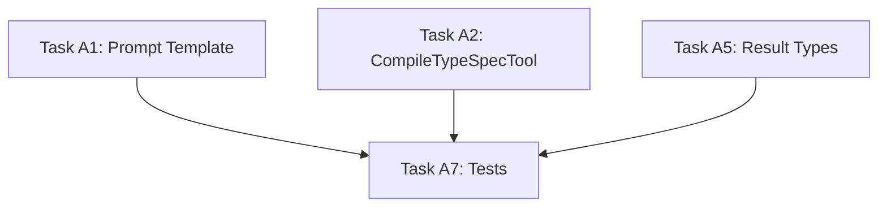

# Phase A Implementation Guide: TypeSpec Customizations Microagent

> **Project Location**: `tools/azsdk-cli/` (Azure SDK Tools CLI)
>
> This implementation builds on the existing microagent infrastructure in `Azure.Sdk.Tools.Cli/Microagents/`.
>
> **Required Reading**: See `doc/microagent-research.md` for detailed documentation on:
> - How `AgentTool<TInput, TOutput>` works (constructor pattern, `Invoke` signature)
> - How `BasePromptTemplate` works (`BuildPrompt`, `BuildStructuredPrompt`)
> - How `NpxOptions` and `INpxHelper` are used to run commands
> - Existing tool patterns (`ReadFileTool`, `WriteFileTool`, etc.)

This guide provides implementation details for building the Phase A (TypeSpec Customizations) microagent. This work can be developed and tested independently of the classifier and Phase B (Code Customizations) work.

## Overview

Phase A applies TypeSpec customizations to `client.tsp` files using `Azure.ClientGenerator.Core` decorators. The microagent:

1. Receives a customization request (build errors, user prompt, API feedback, etc.)
2. Reads existing `client.tsp` content (or creates if doesn't exist)
3. Applies appropriate decorators incrementally (one change at a time)
4. Compiles TypeSpec after each change to validate (`tsp compile ./client.tsp`)
5. Rolls back failed changes, continues with remaining changes
6. Returns summary of successfully applied changes

---

## Architecture

```
┌─────────────────────────────────────────────────────────────────┐
│                  TypeSpec Customization Microagent              │
├─────────────────────────────────────────────────────────────────┤
│  Prompt Template: TypeSpecCustomizationTemplate                 │
│  ├── customizing-client-tsp.md (loaded at runtime)              │
│  └── customization request                                      │
├─────────────────────────────────────────────────────────────────┤
│  Tools:                                                         │
│  ├── ReadFileTool (existing) - read any file under project      │
│  ├── WriteFileTool (existing) - write only to client.tsp        │
│  └── CompileTypeSpecTool (new) - run tsp compile ./client.tsp   │
├─────────────────────────────────────────────────────────────────┤
│  Result: TypeSpecCustomizationResult                            │
│  ├── Success: bool (true if any changes applied)                │
│  ├── ChangesSummary: string[] (what was done)                   │
│  └── FailureReason: string? (if no changes could be applied)    │
└─────────────────────────────────────────────────────────────────┘
```

**Note:** SDK regeneration and build happen OUTSIDE the microagent, in the MCP tool integration layer.

---

## Implementation Details

### WriteFile Restriction

Use the existing `WriteFileTool` but return an error if the path is not `client.tsp`:

```csharp
// In the tool's Invoke method, before writing:
if (Path.GetFileName(input.FilePath) != "client.tsp")
{
    return new WriteFileOutput($"Error: Only client.tsp can be modified. Attempted to write to: {input.FilePath}");
}
```

Alternatively, create a wrapper or subclass. The reference doc already instructs the agent to only modify `client.tsp`, so this is a safety net.

### Reference Doc Path

Pass the reference doc path to the template constructor. The caller (MCP tool) knows the repo structure and can provide the full path to `eng/common/knowledge/customizing-client-tsp.md`.

---

## Implementation Tasks

### Task A1: Create Prompt Template

**File:** `Azure.Sdk.Tools.Cli/Prompts/Templates/TypeSpecCustomizationTemplate.cs`

**Purpose:** Instructs the LLM how to apply `client.tsp` customizations based on the customization request.

**Inputs:**

- `customizationRequest` - The request (build error, user prompt, API feedback, etc.) - includes language context
- `typespecProjectPath` - Path to the TypeSpec project (contains `tspconfig.yaml`)
- `referenceDocPath` - Path to `eng/common/knowledge/customizing-client-tsp.md`

**Design Decisions:**

1. **Reference Document**: Read at runtime from file system (not embedded) - avoids duplicate maintenance
2. **No clientTspContent input**: Agent reads via ReadFileTool (can verify existence/create if needed)
3. **No language input**: Language context is part of `customizationRequest`
4. **File access**: Agent can READ any file under `typespecProjectPath`, but can only WRITE to `client.tsp`
5. **Write restriction**: Use standard WriteFileTool but return error if path is not `client.tsp`

**Key Sections:**

1. **Reference Document**: Full content of `customizing-client-tsp.md` (loaded at runtime)
2. **Task Instructions**: Analyze request → read files as needed → determine decorators → apply to client.tsp
3. **Constraints**: Only modify `client.tsp`, proper decorator syntax, import requirements
4. **Output Requirements**: Use WriteFile tool, then compile/validate

**Template Structure:**

```csharp
public class TypeSpecCustomizationTemplate : BasePromptTemplate
{
    public override string TemplateId => "typespec-customization";
    public override string Version => "1.0.0";
    public override string Description => "Apply TypeSpec client.tsp customizations";

    private readonly string _customizationRequest;
    private readonly string _typespecProjectPath;
    private readonly string _referenceDocPath;

    public TypeSpecCustomizationTemplate(
        string customizationRequest,
        string typespecProjectPath,
        string referenceDocPath)
    {
        _customizationRequest = customizationRequest;
        _typespecProjectPath = typespecProjectPath;
        _referenceDocPath = referenceDocPath;
    }

    public override string BuildPrompt()
    {
        // Read reference doc at runtime
        var referenceDoc = File.ReadAllText(_referenceDocPath);
        
        var taskInstructions = BuildTaskInstructions();
        var constraints = BuildConstraints();
        var examples = BuildExamples();
        var outputRequirements = BuildOutputRequirements();
        return BuildStructuredPrompt(taskInstructions, constraints, examples, outputRequirements);
    }

    // ... implementation
}
```

**Acceptance Criteria:**

- [ ] Template compiles and can be instantiated
- [ ] Reads customizing-client-tsp.md content at runtime
- [ ] Scope of customizations implied by reference document content
- [ ] Instructs agent to read files as needed (main.tsp, etc.) but only write to client.tsp

---

### Task A2: Create CompileTypeSpecTool

**File:** `Azure.Sdk.Tools.Cli/Microagents/Tools/CompileTypeSpecTool.cs`

**Purpose:** Validates TypeSpec syntax by running `tsp compile ./client.tsp`. This is NOT full SDK generation - just syntax validation to ensure `client.tsp` is valid.

**Input Schema:**

```csharp
public record CompileTypeSpecInput();
// No input needed - tool is scoped to the TypeSpec project path at construction
```

**Output Schema:**

```csharp
public record CompileTypeSpecOutput(
    [property: Description("Whether compilation succeeded")]
    bool Success,
    [property: Description("Compilation output/errors")]
    string Output
);
```

**Implementation Notes:**

- Use `INpxHelper` to run `tsp compile ./client.tsp`
- Constructor takes `typespecProjectPath` and `INpxHelper`
- Working directory is the TypeSpec project path
- Consider timeout handling

**Acceptance Criteria:**

- [ ] Tool runs `tsp compile ./client.tsp` in the project directory
- [ ] Returns structured success/failure with output
- [ ] Handles timeout scenarios

---

### ~~Task A3: Create RegenerateSDKTool~~ (REMOVED)

**Reason:** SDK regeneration happens outside the microagent, in the MCP tool integration layer.

---

### ~~Task A4: Create BuildSDKTool~~ (REMOVED)

**Reason:** SDK build happens outside the microagent, after regeneration in the MCP tool integration layer.

---

### Task A5: Define Result Types

**File:** `Azure.Sdk.Tools.Cli/Microagents/TypeSpecCustomizationResult.cs`

**Purpose:** Schema for the microagent's exit result.

```csharp
namespace Azure.Sdk.Tools.Cli.Microagents;

/// <summary>
/// Result returned by the TypeSpec Customization microagent.
/// </summary>
public record TypeSpecCustomizationResult
{
    /// <summary>
    /// Whether any customizations were successfully applied.
    /// True if at least one change was applied successfully.
    /// </summary>
    public required bool Success { get; init; }

    /// <summary>
    /// Summary of changes applied to client.tsp, mapped to the request items they address.
    /// e.g., "Renamed FooClient to BarClient for .NET (addresses: 'client name should be BarClient')"
    /// </summary>
    public required string[] ChangesSummary { get; init; }

    /// <summary>
    /// Reason for failure if Success is false (no changes could be applied).
    /// </summary>
    public string? FailureReason { get; init; }
}
```

**Design Decisions:**

1. **Partial success = Success**: If 3/5 changes succeed, `Success = true`
2. **No BuildErrors**: Build happens outside microagent
3. **No CompilationErrors**: Compilation errors are handled internally (rollback + retry)
4. **ChangesSummary**: Descriptive strings mapping changes to request items

**Acceptance Criteria:**

- [ ] Result type captures success status and change summary
- [ ] JSON serializable for microagent exit

---

### ~~Task A6: Create TypeSpec Customization Microagent Factory~~ (REMOVED)

**Reason:** No factory needed. The MCP tool integration will assemble the microagent directly using the template and tools.

---

### Task A7: Create Unit Tests

**Status:** TO BE REVISITED - testing approach needs further discussion.

**File:** `Azure.Sdk.Tools.Cli.Tests/Microagents/TypeSpecCustomizationMicroagentTests.cs`

**Potential Test Scenarios:**

1. **Template Tests:**
   - Prompt includes reference doc content
   - Prompt includes customization request

2. **Tool Tests:**
   - CompileTypeSpecTool returns success for valid TypeSpec
   - CompileTypeSpecTool returns errors for invalid TypeSpec

3. **Integration Tests (TBD)**

**Acceptance Criteria:**

- [ ] TBD - testing approach needs further discussion

---

## File Structure

```
Azure.Sdk.Tools.Cli/
├── Microagents/
│   ├── Tools/
│   │   ├── CompileTypeSpecTool.cs      # NEW - Task A2
│   │   ├── ReadFileTool.cs             # existing
│   │   └── WriteFileTool.cs            # existing (with client.tsp restriction)
│   └── TypeSpecCustomizationResult.cs  # NEW - Task A5
├── Prompts/
│   └── Templates/
│       └── TypeSpecCustomizationTemplate.cs  # NEW - Task A1
│
Azure.Sdk.Tools.Cli.Tests/
└── Microagents/
    └── (TBD - Task A7)
```

---

## Implementation Order



**Parallel Work:**

- Tasks A1, A2, A5 can all be done in parallel
- Task A7 depends on A1, A2, A5

---

## Microagent Workflow

The prompt instructs the LLM to:

1. **Save original state**: Read and remember current `client.tsp` content (if exists)
2. **For each change needed**:
   - Apply change to `client.tsp`
   - Run `tsp compile ./client.tsp` to validate
   - If compilation fails: rollback that change and try next
   - If compilation succeeds: record the change in summary
3. **Return result**: Summary of successfully applied changes

This enables partial success - if 3/5 changes work, `Success = true` with those 3 changes summarized.

---

## Integration Points (Future - MCP Tool)

The MCP tool integration will:

1. Assemble the microagent using `TypeSpecCustomizationTemplate` and tools
2. Run the microagent via `MicroagentHostService`
3. After microagent completes: regenerate SDK using `tsp-client update`
4. Build SDK to validate
5. Return overall result

**Example microagent assembly (for MCP tool implementer):**

```csharp
// Build prompt
var template = new TypeSpecCustomizationTemplate(
    customizationRequest: "Rename FooClient to BarClient for .NET",
    typespecProjectPath: "/path/to/specs/Foo",
    referenceDocPath: "/path/to/eng/common/knowledge/customizing-client-tsp.md");
var instructions = template.BuildPrompt();

// Configure tools - note: WriteFileTool needs client.tsp restriction
var tools = new List<IAgentTool>
{
    new ReadFileTool(typespecProjectPath),
    new WriteFileTool(typespecProjectPath),  // Add client.tsp check
    new CompileTypeSpecTool(typespecProjectPath, npxHelper),
};

// Create microagent
var microagent = new Microagent<TypeSpecCustomizationResult>
{
    Instructions = instructions,
    Tools = tools,
    Model = "gpt-4.1",
    MaxToolCalls = 20,
};

// Run
var result = await hostService.RunAgentToCompletion(microagent);
```

---

## Open Questions (RESOLVED)

1. **Client.tsp Location**: Standard location only (`{typespecProjectPath}/client.tsp`)
2. **Multi-file Customizations**: Start with single `client.tsp` file, extend later if needed
3. **Rollback**: Handled in prompt - agent saves original, rolls back failed changes
4. **Retries**: Agent applies changes incrementally with compile-after-each; partial success is acceptable

---

## Existing Infrastructure Reference

The following components **already exist** and should be reused:

### Microagent Framework (`Azure.Sdk.Tools.Cli/Microagents/`)

- `IAgentTool` - Interface for tools (Name, Description, InputSchema, Invoke)
- `AgentTool<TInput, TOutput>` - Generic base class with JSON serialization
- `Microagent<TResult>` - Agent definition with instructions, tools, validation
- `MicroagentValidationResult` - Result validation schema
- `MicroagentHostService` - Runs agent loop with OpenAI
- `ToolHelpers` - JSON schema generation, safe path resolution

### Existing Tools (`Azure.Sdk.Tools.Cli/Microagents/Tools/`)

- `ReadFileTool` - Read files relative to a base directory
- `WriteFileTool` - Write files relative to a base directory
- `ListFilesTool` - List directory contents
- `ClientCustomizationCodePatchTool` - Apply code patches

### Prompt Templates (`Azure.Sdk.Tools.Cli/Prompts/`)

- `BasePromptTemplate` - Abstract base with `BuildStructuredPrompt()` helper
- Examples: `JavaPatchGenerationTemplate`, `SpellingValidationTemplate`

### Helpers (`Azure.Sdk.Tools.Cli/Helpers/`)

- `ITspClientHelper` / `TspClientHelper` - tsp-client commands (update, init, convert)
- `ISpecGenSdkConfigHelper` / `SpecGenSdkConfigHelper` - SDK build configuration
- `ITypeSpecHelper` / `TypeSpecHelper` - TypeSpec project validation
- `IProcessHelper` / `ProcessHelperBase` - Process execution
- `IGitHelper` / `GitHelper` - Git operations

### Reference Documentation

- `eng/common/knowledge/customizing-client-tsp.md` - **EXISTS** (476 lines)
  - Complete guide to `@access`, `@client`, `@clientName`, `@operationGroup`, etc.
  - Scope parameter documentation for language-specific customizations
  - Examples for common customization patterns
